# 연구 데이터 파이프라인

## 전체 흐름 개요

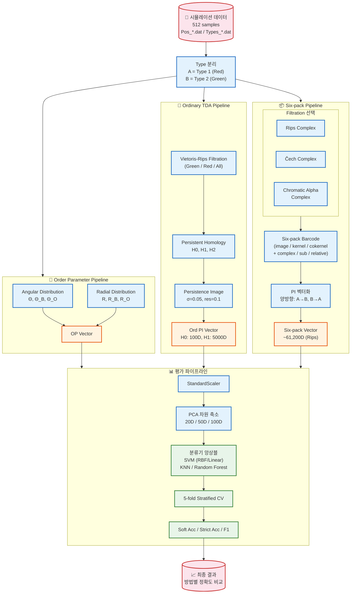

---

## 파이프라인 상세

### 1️⃣ 데이터 입력

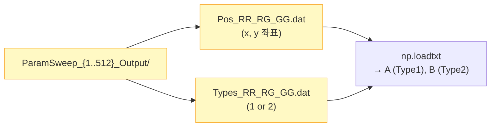

| 항목 | 값 |
|------|-----|
| 총 샘플 수 | 512개 (8×8×8 파라미터 조합) |
| 파라미터 | RR, RG, GG ∈ {0.0, 0.01, 0.05, 0.09, 0.13, 0.17, 0.21, 0.25} |
| 클래스 수 | 12개 (Phase 0–13, 일부 미사용) |
| 저장 위치 | Google Drive `/URP/ParamSweep_*_Output/` |

---

### 2️⃣ Six-pack Barcode 계산 (핵심)

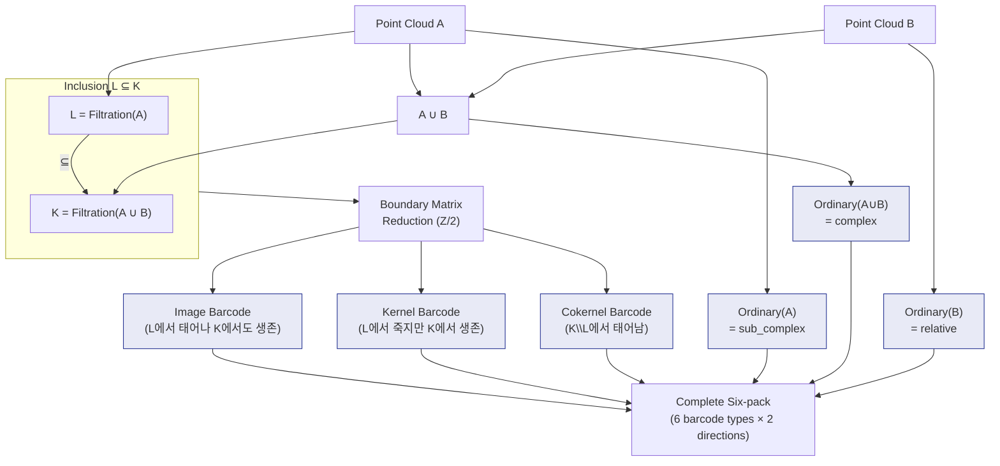

#### Filtration 방식별 비교

| Filtration | 노트북 | `max_radius` | 성능 (Soft Acc) | 비고 |
|-----------|--------|-------------|----------------|------|
| **Vietoris-Rips** | `Sixpack_Rips.ipynb` | 10 | **~93%** ⭐ | |
| **Čech** | `Phase5_Sixpack_Cech.ipynb` | 5 | 실험 예정 | Drel로 H*(K,L) 직접 계산 |
| **Chromatic Alpha** | `Six-pack (chromatic_tda).ipynb` | 10 | ~77% | |

---

### 3️⃣ PI 벡터화

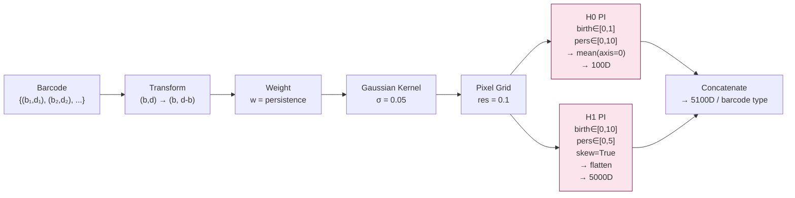

---

### 4️⃣ 평가 파이프라인

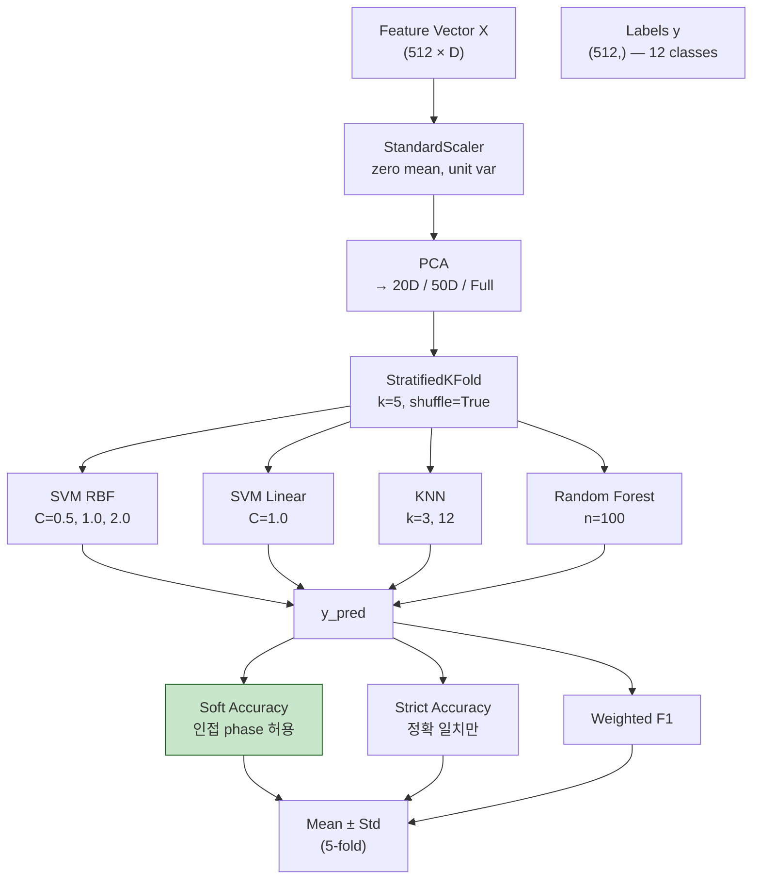

#### Adjacent Phase 관계

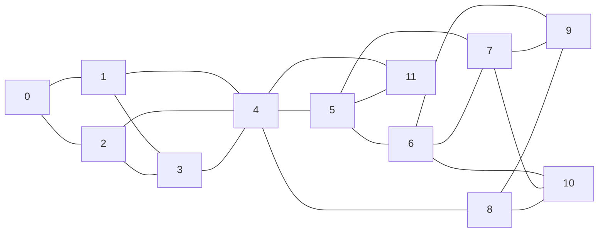

> Soft Accuracy에서는 위 그래프에서 **간선으로 연결된 phase 간 오분류를 정답으로 간주**합니다.

---

### 5️⃣ 파일 저장 구조

```
Google Drive/URP/
├── ParamSweep_{1..512}_Output/     ← 원본 시뮬레이션
│   ├── Pos_RR_RG_GG.dat
│   └── Types_RR_RG_GG.dat
│
└── 1224_Vectors/                   ← 벡터화 결과
    ├── Sixpack_Rips/
    │   └── Sixpack_Rips_{1..512}.npz
    ├── Sixpack_Chroma*/
    │   └── Sixpack_Chroma_{1..512}.npz
    └── Sixpack_Cech/               ← Phase 5 (신규)
        └── Sixpack_Cech_{1..512}.npz
```

각 `.npz` 파일 구조:
- `arr_0` = `PI_A_to_B` (dict: barcode_type → {0: H0_vec, 1: H1_vec})
- `arr_1` = `PI_B_to_A` (dict: 동일 구조)

---

## 6️⃣ 7가지 Descriptor Vector 상세

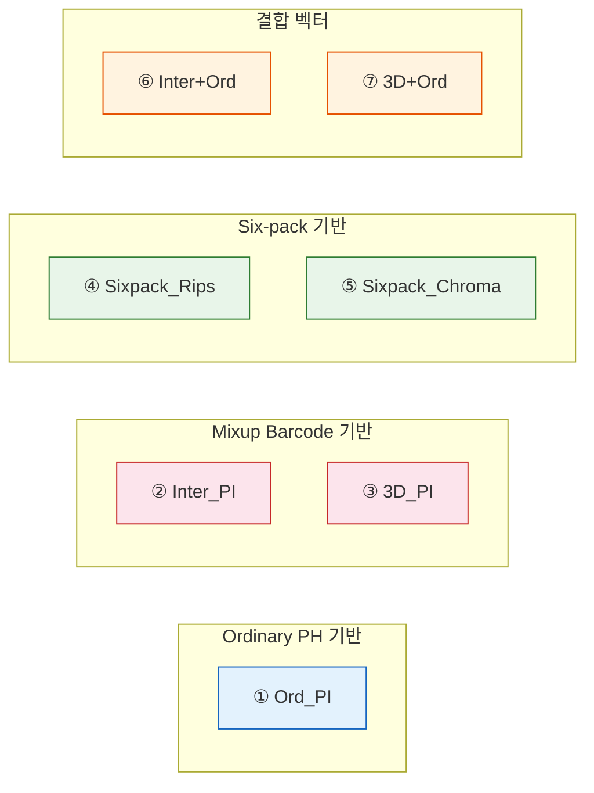

---

### ① Ord_PI (Ordinary Persistence Image)

**기본적인 TDA 벡터.** 각 sub-population에 대해 독립적으로 VR filtration → PH → PI 수행.

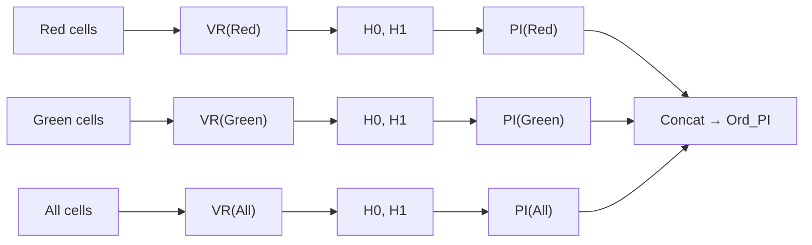

| 항목 | 값 |
|------|-----|
| Filtration | Vietoris-Rips |
| Sub-populations | Red / Green / All (3개) |
| Homology 차원 | H0, H1 |
| 벡터 크기 | 3 × (H0: 100D + H1: 5000D) = **15,300D** |
| PI 파라미터 | σ=0.05, res=0.1, weight=persistence |
| 성능 | 중상위 |

---

### ② Inter_PI (Interaction Persistence Image)

**Mixup barcode에서 추출한 interaction 정보.** A와 B 사이의 상호작용을 topology로 포착.

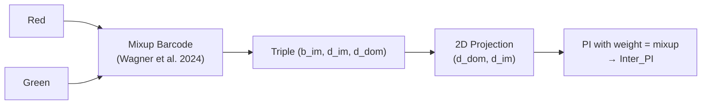

| 항목 | 값 |
|------|-----|
| Barcode 원천 | Mixup barcode (canonical matching) |
| 좌표 | $(d_{dom}, d_{im})$ — domain death × image death |
| Weight function | **mixup** (interaction 강도 반영) |
| 성능 | Ord_PI 대비 **+1~2%** 향상 |
| 의의 | A, B 간 상호작용 정보를 직접 포착 |

---

### ③ 3D_PI (3D Persistence Image)

**Mixup barcode의 전체 triple을 3D PI로 벡터화.** 더 풍부한 정보를 담지만 차원이 높음.


| 항목 | 값 |
|------|-----|
| Barcode 원천 | Mixup barcode |
| 좌표 | $(b_{im}, d_{im}, d_{dom})$ — 3차원 전체 활용 |
| Weight function | **1** (균등 가중) |
| 성능 | **하위** — weight=1이 저조한 성능의 주요 원인 |
| 보완 계획 | weight=mixup 또는 weight=mixup+persistence 실험 예정 (Phase 3) |

---

### ④ Sixpack_Rips (Six-pack from Vietoris-Rips)

**최고 성능 벡터.** Rips complex 기반으로 L⊆K inclusion의 6가지 barcode를 모두 활용.

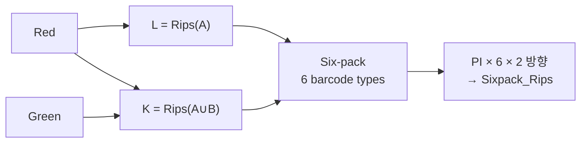

| 항목 | 값 |
|------|-----|
| Filtration | Vietoris-Rips (max_edge=10) |
| Barcode 종류 | image, kernel, cokernel, complex, sub_complex, relative (6개) |
| 방향 | A→B + B→A (양방향) |
| 벡터 크기 | 6 × 2 × (H0:100D + H1:5000D) = **61,200D** |
| 성능 | **⭐ 최고** — Soft 93.0%, Strict 83.98% |

---

### ⑤ Sixpack_Chroma (Six-pack from Chromatic Alpha)

**Chromatic Alpha Complex 기반 six-pack.** 색상 정보를 filtration에 직접 반영하나, 성능은 최하위.


| 항목 | 값 |
|------|-----|
| Filtration | Chromatic Alpha Complex (`chromatic_tda` 라이브러리) |
| 파라미터 | max_alpha=10, sub_complex='0', full_complex='all' |
| 벡터 크기 | **61,200D** (Rips와 동일 구조) |
| 성능 | **최하위** ~77% — 파라미터 튜닝으로도 개선 불가 (구조적 한계) |
| H0 birth_range | (0, 0.01) — Rips 대비 매우 좁음 |

---

### ⑥ Inter+Ord (Interaction PI + Ordinary PI)

**Inter_PI와 Ord_PI를 단순 연결(concatenation)한 결합 벡터.**

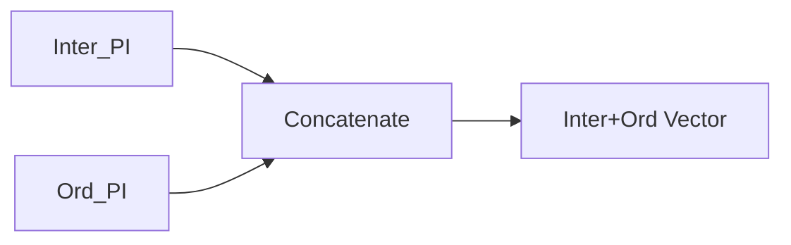

| 항목 | 값 |
|------|-----|
| 구성 | Inter_PI ⊕ Ord_PI |
| 의도 | Interaction 정보 + Ordinary topology 정보 결합 |
| 성능 | Ord_PI보다 소폭 향상 (Inter_PI의 기여) |

---

### ⑦ 3D+Ord (3D PI + Ordinary PI)

**3D_PI와 Ord_PI를 단순 연결한 결합 벡터.**

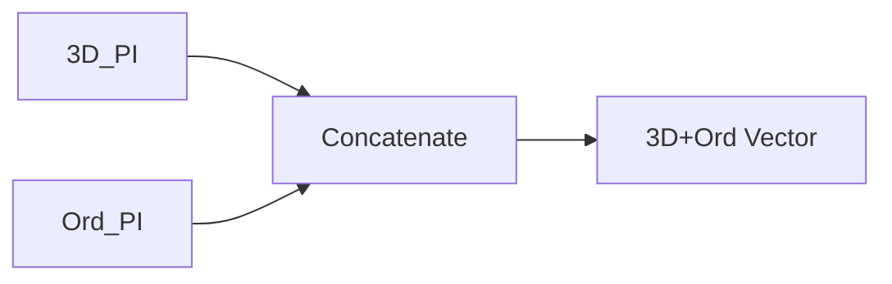

| 항목 | 값 |
|------|-----|
| 구성 | 3D_PI ⊕ Ord_PI |
| 성능 | **Ord_PI보다 저조** — 3D_PI의 낮은 품질이 Ord_PI를 희석 |
| 원인 | 단순 concat 시 고차원 노이즈가 PCA 축소 과정에서 유용한 정보를 가림 |
| 보완 계획 | 개별 normalization → concat, weight 기반 결합 등 실험 예정 (Phase 4) |

---

### 성능 종합 비교

| 순위 | Vector | Soft Acc (%) | Strict Acc (%) | 핵심 특성 |
|:---:|--------|:-----------:|:-------------:|----------|
| 🥇 | **Sixpack_Rips** | ~93 | ~84 | Rips 기반 six-pack 전체 활용 |
| 🥈 | **Inter+Ord** | 중상위 | 중상위 | Interaction + Ordinary 결합 |
| 🥉 | **Inter_PI** | 중상위 | 중상위 | Mixup barcode의 interaction 정보 |
| 4 | **Ord_PI** | 중상위 | 중상위 | 기본 TDA 벡터 (baseline) |
| 5 | **3D+Ord** | 하위 | 하위 | 3D_PI가 Ord_PI를 희석 |
| 6 | **3D_PI** | 하위 | 하위 | weight=1의 한계 |
| 7 | **Sixpack_Chroma** | ~77 | ~68 | Chromatic Alpha의 구조적 한계 |
