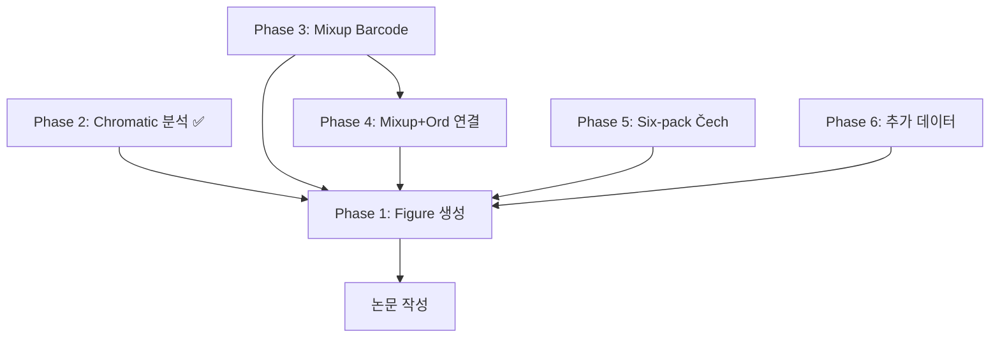

# 보완 실험 계획 — Phase별 정리

> 원본: `보완 실험 계획.pdf` 기반 정리 (2026-02-18)

---

## Phase 1: Figure 생성 및 결과 정리

논문에 실험 결과를 넣기 위한 figure/table 작업.

### 1-1. Classification 결과 Table & Bar Chart
- [ ] 실험 조건별 정확도 table 생성
  - 조건: Unsupervised/Supervised, 차원축소 알고리즘, reduction 차원, descriptor vector, evaluation method
- [ ] Bar chart 생성 (한눈에 비교 가능하도록)
- [ ] 가장 잘 된 case 몇개 선택 → 논문 본문, 나머지 → Appendix
  - Unsupervised/Supervised 각각 1~2개 best case

### 1-2. 2D Embedding Visualization
- [ ] Classification 결과를 2D embedding으로 시각화
  - 참고: [TDA of spatial pattern, 2023] 방식
- [ ] 구체적 시각화 방법 결정 (t-SNE, UMAP 등)

### 1-3. Confusion Matrix
- [ ] 현재 양식 유지하되 논문 수준으로 정리
- [ ] Identity matrix와의 유사도 정량 측정 (Frobenius norm 등)
  - Six-pack이 얼마나 정확한지 수치로 제시

### 1-4. 추가 평가 지표
- [ ] F1 Score 등 standard 평가 지표 추가
- [ ] Soft/Hard evaluation 외 다양한 통계량 활용

### 1-5. Ablation Study
- [ ] Six-pack 6개 diagram 중 개별 기여도 분석
  - Ordinary PI에 없는 추가 정보: **kernel, image, cokernel** barcode
- [ ] 실험 설계:
  - 각 barcode 1개만 사용
  - 2개 조합 사용
  - Ordinary PI 단독 결과와 비교
  - 완전한 Six-pack 결과와 비교

---

## Phase 2: Six-pack (Chromatic) 분석 ✅ 부분 완료

Chromatic alpha filtration 기반 결과가 전체 최하위인 원인 분석 및 개선 시도.

### 2-1. 파라미터 튜닝 실험 ✅ 완료
- [x] max_alpha 변경 (10, 15, 20) → alpha 증가 시 오히려 성능 하락 확인
- [x] sigma(bandwidth) 변경 (0.01~0.2) → σ=0.05가 최적 확인
- [x] H0 birth_range 변경 (0.01, 0.1, 1.0) → 영향 미미 확인
- [x] PCA 차원 변경 실험

### 2-2. 결론 도출 ✅ 완료
- [x] 파라미터 튜닝으로 Sixpack_Rips와의 격차 해소 불가 확인
- [x] Best: `alpha10_sigma0.05_br0.1` → Strict 77.15% (Rips: 85.35%)
- [x] **Chromatic Alpha Complex 자체의 구조적 한계**로 결론

---

## Phase 3: Mixup Barcode 개선

Interaction PI는 1~2% 향상, 3D PI 및 Mixup+Ord는 Ordinary PI보다 저조 → 보완 실험.

### 3-1. Interaction PI 추가 실험
- [ ] Weight function 변경 실험:
  - 현재: `weight = mixup`
  - 추가: `weight = mixup + persistence` (논문에서의 자연스러운 일반화)
- [ ] 결과에 따라 논문 작성 방식 결정

### 3-2. 3D PI 개선
- [ ] Weight function 변경:
  - 현재: `weight = 1` (성능 저조 원인)
  - 실험 1: `weight = mixup`
  - 실험 2: `weight = mixup + persistence`
- [ ] Resolution 변경 실험
- [ ] Bandwidth 변경 실험
- [ ] 적절한 파라미터 탐색

### 3-3. Mixup Barcode 재계산
- [ ] 시간이 오래 걸리므로 먼저 barcode 계산 시작
- [ ] 필요 조건에 따라 벡터화 추가 계산

---

## Phase 4: Mixup Barcode + Ordinary PI 연결 방식 개선

정보량이 Ord PI보다 많음에도 성능이 낮은 원인 = 단순 연결(concatenation) 문제.

- [ ] Normalization 적용 후 연결
- [ ] Pre-processing 방법 탐색
- [ ] Weight 부여 방식 변경
- [ ] 여러 연결 방식 실험 및 최적 조합 탐색

---

## Phase 5: Six-pack (Čech) — 새로운 접근

Six-pack 계산의 새로운 아이디어. 수학적으로 시도할 가치 있음.

- [ ] Čech complex 기반 six-pack 계산 구현
- [ ] 벡터화: 기존 six-pack invariant와 동일한 방법 사용
- [ ] 기존 Rips/Chromatic 결과와 비교

---

## Phase 6: 추가 사항

### 6-1. Chromatic Pattern 추가 생성
- [ ] 현재: 512개 × 1 set
- [ ] 목표: 최소 3개 data set 생성 → 통계적 안정성 확보

### 6-2. 3색 이상 실험
- [ ] 2색에서 Six-pack(Rips) 99%+ → 3색에서도 높은 성능 예상
- [ ] 3색 chromatic pattern 생성
- [ ] 동일 파이프라인으로 실험 진행

---

## 우선순위 & 의존관계

| 우선순위 | Phase | 예상 소요 | 비고 |
|---------|-------|----------|------|
| 🔴 높음 | Phase 1 (Figure) | 중간 | 논문 작성 직결 |
| ✅ 완료 | Phase 2 (Chromatic) | — | 파라미터 튜닝 완료 |
| 🔴 높음 | Phase 3 (Mixup) | 높음(계산 오래 걸림) | barcode 재계산 필요 |
| 🟡 중간 | Phase 4 (연결 개선) | 낮음 | Phase 3 이후 |
| 🟡 중간 | Phase 5 (Čech) | 높음 | 새로운 구현 필요 |
| 🟢 낮음 | Phase 6 (추가) | 높음 | 3+ dataset 생성 |
